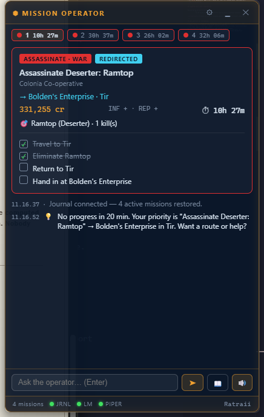
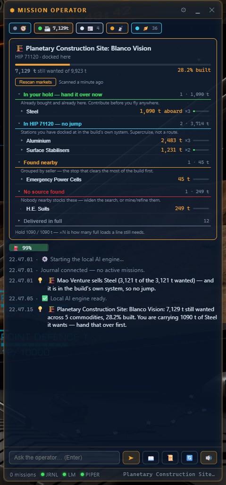
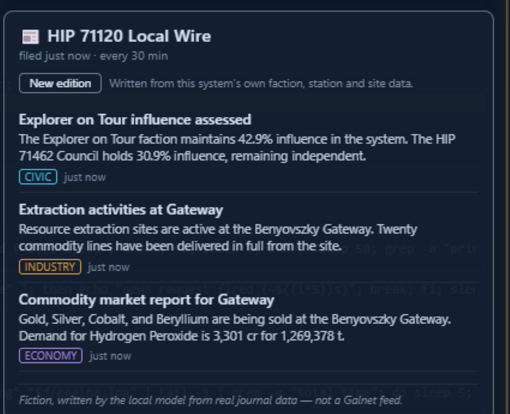
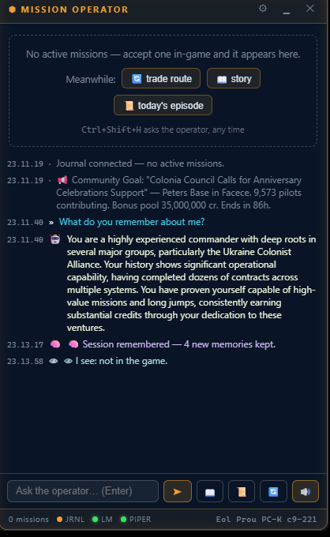
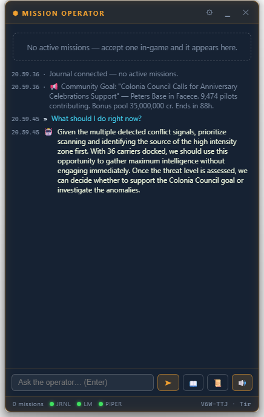

# Elite Dangerous — Mission Operator

**Home page & downloads: [edmo.blinkki.com](https://edmo.blinkki.com)**

An **always-on-top HUD** companion for Elite Dangerous. It reads your **active missions** live from
the Player Journal, shows them as cards with synthesized objective checklists and countdown timers,
gives **AI operator guidance** via its own bundled llama.cpp engine, speaks with a **bundled local
neural voice** (Piper), and runs a **proactive heartbeat** that nudges you when you stall.

Alongside the mission cards there are five tabs for the panels the game keeps somewhere you cannot
read while flying: a **route plotter** (neutron highway for the ship, the whole carrier trip jump by
jump, tritium counted), an **orrery** showing where this system's bodies are right now, the **World
of Death** landing-window clock, a **system architect** shopping list for colonisation builds, and a
**local wire** that writes fictional news about the system you are actually in.

Everything runs on your machine. No cloud, no telemetry, no account.

<p align="center">
  
  &nbsp;
  
</p>
<p align="center">
  <sub><b>Mission cards</b> — objectives the game never shows &nbsp;·&nbsp;
  <b>System architect</b> — 6,703 t of build, sorted into a shopping run</sub>
</p>

```
┌────────────────────────────────────┐
│  ⬢ MISSION OPERATOR        ⚙ ▁ ✕  │   ← draggable, always on top
├────────────────────────────────────┤
│  ASSASSINATE · EG Union            │
│  Assassinate Known Pirate: LazerFX │
│  → Hyperion Monolith 001 · Aoesta  │
│  1,564,280 cr        ⏱ 9h 12m     │
│  [✓] Travel to target system       │
│  [✓] Eliminate LazerFX             │
│  [ ] Return & hand in              │
├────────────────────────────────────┤
│  21:14  💡 You've been in Bingui   │
│         8 min without engaging …   │
│  21:22  🎯 Target eliminated.      │
│         Return to Malchiodi City…  │
├────────────────────────────────────┤
│  [ Ask the operator…          ] ➤🔊│
│  3 missions · JRNL● LM● PIPER●     │
└────────────────────────────────────┘
```

## Install & run (one click)

Download it from **[edmo.blinkki.com](https://edmo.blinkki.com)** — or build it yourself with
`npm run tauri build` (output in `src-tauri/target/release/bundle/nsis/`). Double-click, done. It installs per-user (no admin),
including the offline voice, and starts the HUD. Optional extras:

1. **AI engine** — Settings → AI engine: pick a model and the app fetches its own
   llama.cpp runtime + the GGUF (~3–6 GB one time, resumable), then launches and owns the
   engine itself. The `LM` pill goes green when it is serving. (LM Studio support was removed
   after 1.3.0 — one engine the app launches and can read the logs of, instead of two it can
   only poke over HTTP. GGUF+mmproj pairs already on disk are still discovered and reused.)
   Not sure what your rig can handle? **Settings → AI operator** reads your **RAM, CPU and GPU
   VRAM** and warns when the active model will not fit, with a concrete "aim for ≤ N B
   parameters" recommendation. If the active model looks too big, the footer shows `LM⚠` and
   Settings explains why.
2. **Elite Dangerous**: just play. The HUD auto-finds
   `%USERPROFILE%\Saved Games\Frontier Developments\Elite Dangerous\` and follows the newest
   journal. Run ED in **Borderless/Windowed** mode so the overlay can sit on top.

Without the game running you can still try it: **Settings → Manual import**, paste journal lines.

## The voice — local TTS model, fully offline

The app bundles **[Piper](https://github.com/rhasspy/piper)** with the **en_GB "Alba" medium**
neural voice (~63 MB ONNX model). Synthesis runs ~7× faster than realtime on CPU, entirely offline —
mission text never leaves your machine (unlike Windows "Natural" voices, which are cloud-backed).

- Default engine: **Piper** (private, no network).
- Fallback/alternative: Windows system voices, with **local-voices-only on by default** — cloud
  voices are filtered out and clearly labelled `(CLOUD)` if you opt in.
- Spoken events: mission accepted, redirect, arrival at hand-in, completion/failure, expiry
  warnings, and heartbeat nudges. A queue with de-duplication guarantees nothing is spoken twice.
- The **local wire** can be read by a *different* voice (Settings → Local wire → newsreader voice),
  so a bulletin does not sound like the operator talking about the news. The voice travels with
  each queued utterance, not with the settings, so an operator line and a bulletin can be queued
  together without borrowing each other's voice.

## The local wire — fictional news for the system you are in

Galnet reports the galaxy; nothing reports the system you are standing in. The 📰 tab writes it,
using your own local model, from a brief of things the journal says are **true right now**: the
faction board with real influence figures, the stations and signals, the markets you have read, the
construction sites, and the doors that have refused you docking.

<p align="center">
  
</p>
<p align="center">
  <sub>Every figure here came out of the journal — the model chose among them and wrote them up.</sub>
</p>

- **Six desks take turns** — civic, industry, economy, crime, sport, life — so it reads as a paper
  rather than an almanac. A desk only opens when the brief can support it.
- **The economy desk is a real market report.** A price with nothing to compare it against is a
  listing, so the wire keeps its own price memory: what a commodity did since you last read that
  board, the spread between two stations, and who is paying over the odds.
- **It may invent people, teams and bars; it may not invent a faction, a station or a price.**
  Anything it makes up is checked against the brief, and a new name shaped like a real place is
  dropped unprinted.
- **It remembers what it invented.** The dock-crew league keeps the same two teams from one edition
  to the next; the cast is persisted and offered back to the model as continuity.
- **House style** is switchable: *wry* (a veteran correspondent who has read every announcement
  these people ever issued and believed none of them) or *straight* reporting.

Off by default — it costs one model call per edition. Cadence runs from every 10 minutes to hourly,
or Off with a **New edition** button in the tab.

## Comms traffic — the channel other people are on

Not the operator. Other people: traffic control, hauliers on the open channel, a fleet carrier
broadcasting at everyone, your own crew on the intercom. Mostly they do not care that you exist,
which is what makes the ones who do land.

> **This is not the same thing as "Chatter" in Settings.** *Chatter* is the operator telling you
> fictional stories about your contracts. *Comms traffic* is the rest of the galaxy talking among
> itself. They can be enabled independently.

**A transmission is a scene, not a line.** One to four turns with at least two speakers, because a
call and a response imply two people who exist independently of you. Each scene also has a job —
it establishes something, complicates it, turns it, or reacts to something that already happened.

**Everything it states is true.** Every scene is built from a *brief*: the exact set of names and
figures it is allowed to use, each tagged with where it came from. A haulier grumbling that
Bertrandite dropped another 380 at Hurston Ring is quoting **your own market memory**. Anything
generated is checked back against its brief before it is spoken, and a scene that reached for a
faction, a station or a number nobody licensed is dropped whole. Ambience that doubles as
intelligence — and silence is always the safe failure.

Prices carry their age. A fresh one is stated plainly; an old one is framed as hearsay ("last I
looked, three days back…"); one past a week builds no scene at all.

**Range is real.** Station traffic gates on the actual distance to the port, taken from the orrery,
and fades in as you close — so it sounds distant when it is distant, and a port the app cannot
place stays silent rather than being invented. Deep space is not a distance threshold; it is what
is left when nobody is in reach.

**Voices come back.** A callsign heard in a system is remembered, keeps the same voice, and is
preferred next time you are there. Ships you *actually* hear on the game's NPC channel can be
enrolled into that cast, so the fiction has a spine of things that genuinely happened. Threads
run across sessions: something set up gets complicated, and eventually pays off.

**It knows when to shut up.** Chatter thins as pressure rises — the opposite of the operator, which
leans in. In a firefight or a hull emergency every ambient channel goes silent. The sudden absence
of noise you had stopped noticing is the cheapest tension the app has, and it costs nothing to
generate.

**How busy** is a setting of its own — sparse, normal, busy or bustling — and it is deliberately
NOT tied to the copilot's involvement level, because "how often should my operator speak" and "how
populated should this system sound" are different questions. The default, *busy*, works out around
ninety transmissions an hour in a system with ports in it: roughly one every forty seconds, spread
across whichever channels are open.

**The model keeps writing.** Where a fixed grammar eventually repeats itself — however many lines
are authored, the rotation is finite — your local LLM writes fresh scenes into the same slots the
event triggers use, continuously, for whatever channels are live. The bundled templates are the
floor rather than the ceiling: what you hear when the model is busy, absent, or wrote something
that failed its brief.

**It cycles rather than shuffles.** Templates are chosen least-recently-used first, not at random,
because random picking clusters: with a finite catalogue you hear some lines three times before
others get an airing once. Measured over an hour at the shipped density, 88% of transmissions are
distinct lines, nothing plays more than twice, and no line comes back inside nineteen minutes. That
ordering is persisted, so a restart does not replay the same openers. Note that "distinct" here
counts *templates*, not strings — two renderings of one line differ by a ship name and are the same
line to anyone listening, which is exactly the trap the first version fell into.

The **Comms** tab shows every channel, its signal strength, and — when one is shut — *why*. Each
transmission is logged with its speakers, so the whole feature works with the audio off, and
anything carrying reported intelligence is marked and its sources inspectable.

Off by default.

### Making it your own — the template file

The words come from a plain-text template file, and you can extend it. Declare your own token
pools and use them anywhere:

```
@ShipNamePool
Nostromo
Rocinante
Aluminum Falcon

LOCAL texture
[hauler]  Anybody actually running the <ShipNamePool>, or is that transponder borrowed?
[hauler2] Borrowed. Do not make it a thing.
```

- `CHANNEL function` opens a scene. Channels: `STATION`, `LOCAL`, `CREW`, `DEEP`, `EMERGENCY`,
  `CARRIER`, `CONCOURSE`. Functions: `establish`, `complicate`, `reverse`, `aftermath`, `texture`.
- `CHANNEL function (market, faction)` restricts a template to briefs of that kind, so it can use
  the tokens those briefs supply (`<commodity>`, `<price>`, `<faction>`, `<influence>`, `<station>`,
  `<origin>`, `<system>`, …).
- `[speaker] line` is one turn. Multi-turn scenes need at least two distinct speakers.
- A template whose tokens cannot all be filled is **skipped**, never spoken half-bound — a literal
  `<station>` will never go out over the air.
- Your file is merged *over* the bundled one: templates are added, and a pool of the same name is
  extended rather than replaced. A syntax error is reported in Settings and skipped; the bundled
  templates always load.

## The radio bus

Every spoken word — the operator, the wire, the saga, comms traffic — runs through a radio channel:
a bandpass into the telephone band, a little soft-clip saturation, a noise bed gated to the
transmission, occasional crackle, a squelch gap before speech and a roger beep after it. Each
channel has its own character, and distance degrades it.

Two buses, and the split matters: the operator is on **priority**, ambient traffic is on
**ambient**. Ambient ducks about 14 dB under the operator and *drops* rather than queues when it
backs up, so a dock worker's joke can never delay a hull-breach callout, and a transmission that
has gone stale is discarded instead of arriving late.

Piper voices only — Windows' own speech engine gives no access to its output, so with system voices
the profile is accepted and ignored.

## The orrery — where everything is, right now

Every `Scan` since game v4.0 U14 carries the body's whole Keplerian element set — semi-major axis,
eccentricity, inclination, argument of periapsis, ascending node, mean anomaly and period, with the
scan timestamp as the epoch. That is enough to place the body at any instant, so the 🪐 tab is a
closed form rather than a simulation: warping time evaluates the same equations at a different `t`,
and nothing drifts because nothing integrates.

- **Top-down, deliberately.** Three dimensions in a 420 px panel buys a camera angle to fiddle with
  and loses the thing the panel is for. Inclination is applied and then projected, so a steeply
  inclined moon draws where it really is from above.
- **Planet distances are to scale; only moons are spread.** A leg of 1,900 ls draws at just under
  half a cluster sitting at 4,000, because that is the proportion a commander actually flies — the
  log compression that used to draw them at 92% of each other now applies only within a planet's
  own satellite system, where it keeps a 1 ls moon visible. Zoom and follow are what made this
  affordable: the inner system collapsing to a knot at 1× is one wheel-tick from legible. The
  `exact` toggle still believes every number everywhere, and the card says which mode it is in,
  always.
  A **true distances** toggle shows the real thing, with the inner system collapsed onto the star,
  because that is where it is.
- **Overlaps are separated, because separation is the point.** A map answers "what is here, and
  what is near what"; two moons drawn as one dot answer neither. Bodies that would collide are
  relaxed apart, deterministically (no jitter between frames) and within a hard displacement
  budget, so each stays recognisably on its own orbit ring — and the selected body draws a leader
  back to its true position rather than letting the ring quietly disagree with the dot. Measured on
  a real 36-body system: **21 overlapping pairs before, none after, mean displacement 2.7 px.**
  It does not run in true-distance mode; that mode exists to be believed.
- **Every body is named**, not just the stars — you cannot look up "the green one". Each name is
  offered four berths around its body and takes the first that clashes with neither another name
  nor any body; one with nowhere to go is skipped rather than stacked. That skip is what makes
  zooming worth doing: berths open as bodies spread, so the names fill in as you go (24 of 36 at
  full-system view, 35 zoomed in, and none overlapping at either).
- **Lit from their own star.** Each body is shaded with the terminator facing the star that
  actually lights it — nearest star, which matters in a binary — so the day side on screen is the
  day side in the game. That direction comes from the same elements as the positions, making it
  the one part of a drawn planet that is derived rather than invented. Measured: lit limb within
  **1.4°** of the true bearing.
- **Surfaces are generated, not downloaded.** Elite ships no texture maps and this app ships no
  asset files, so planets are painted from the one thing the journal does state — their class.
  Icy reads as ice, gas giants get bands, metal-rich goes ochre. It is `feTurbulence` (Perlin
  noise the browser composites on the GPU) baked into one `<pattern>` per class, so the cost is
  fixed no matter how many bodies a system has, and it only switches on past 2.2× zoom where
  there is a surface big enough to see. The grain is invention and is kept generic on purpose;
  nothing claims to be a photograph of that particular world.
- **Landable worlds keep their green**, now as a rim rather than a fill, so painting bodies by
  class did not cost the one fact on the map you can act on.
- **Follow keeps the camera on your ship.** The `▲ recenter` chip snaps the camera to the marker —
  parked chevron or in-flight band — and stays with it; while following, zoom anchors on the ship,
  so you can wheel in and out freely without the marker leaving centre. In supercruise the zoom is
  **dynamic**: wide at departure — the destination held near the frame's edge, so a long leg shows
  most of the system — tightening continuously as you close, and easing back out when the target
  leaves the map (a hyperspace destination). Touch the wheel and the camera is yours; a new leg or
  a recenter tap re-arms it. Grabbing the map lets go,
  because a drag is the statement that you want to look somewhere else (double-click, which frames
  the whole system, lets go too) — and the chip flips back to `▲ recenter`, one tap from resuming.
- **The HUD switches tabs with the game** (Settings → HUD to turn it off): opening a station
  market while a colonisation build is on the books brings up the architect's shopping list, and
  undocking brings back the system map — the moment a commander cannot click the HUD is the moment
  the game is being played. Only ever moves between tabs a click could reach: no build, or a
  system too bare to draw, switches nothing.
- **Scroll to zoom, drag to pan**, double-click to reframe. Zoom is anchored on the pointer, and
  bodies grow sub-linearly with it (`^0.55`) — visible enough to have a surface, never so large
  that two planets fill the panel.
- **The ship is drawn parked, not just in flight.** Docked or dropped somewhere, a filled cyan
  chevron marks the exact dock — filled because an arrival is a fact the journal stated, where the
  in-flight marker is hollow because it is an estimate. Flying toward somewhere the map cannot
  place yet (a station never visited), the card says so instead of going silent. The history
  sweep also collects every dock ever visited — `Docked`, `ApproachSettlement`, station
  `Location`/`SupercruiseExit` lines — so stations from old sessions are on the map at boot,
  and it folds them through a state-free path so replaying last year's arrivals cannot teleport
  the live ship.
- **Docks are on the map too.** Stations, outposts, settlements and construction depots, as small
  amber marks beside the body they belong to. They are not bodies and never receive a `Scan`, so
  they have no orbit to place them by — a surface port states its world outright
  (`ApproachSettlement` gives the `BodyID` and even a latitude), while an orbital one is matched to
  the body it orbits by distance from the arrival star, which both measure: Anders City reports
  970.04 ls and its world 970.0. Anything that cannot be matched within a few light-seconds is left
  undrawn rather than parked beside the wrong planet, and **fleet carriers are excluded outright**
  — they jump, and this table is persisted.
- **Your ship, as honestly as it can be drawn.** Elite reports no in-system position — Status.json
  carries flags, fuel, cargo and the nav target, and nothing else — so a moving dot would be the
  only invented number on the map. Instead the leg you are flying is drawn from where you dropped
  to supercruise toward whatever you have targeted (read live, so retargeting follows), and your
  progress along it is shown as **a band, not a point**: somewhere between the fastest and slowest
  legs actually recorded in your own journals. Measured across those journals, distance barely
  predicts duration at all — 0.2 ls took 8 s, 0.8 ls took 134 s, and the same 4,697 ls run took
  137 s, 162 s and 304 s on different days, giving a best-fit curve a mean error of 112%. So the
  band is wide because the truth is wide, it slides as you fly, and it is replaced by fact the
  moment you arrive.
- **Tap a body for its card.** Distances, orbital period, eccentricity, surface temperature,
  atmosphere, volcanism, tidal lock — and **gravity in G**, amber past 2 and red past 3, because
  that is the number that writes off ships rather than trivia. Landable bodies list their
  **surface materials richest first, each annotated with how many you already carry**, since the
  materials tracker has been folding your grid all along. Rarity does the shouting, not the
  percentage: iron at 21% stays grey while you hold 300 of it; *tellurium at 1% with none held* is
  the line worth flying for. First footfall is called out where nobody has walked yet.
- **Only what you scanned — but everything you ever scanned.** No EDSM, no backfill, no bodies
  placed "approximately" at periapsis. The honk carries no orbits (`FSSDiscoveryScan` reports how
  many bodies exist and lists signal sources; the elements only ever ride on a `Scan`), and the
  session bootstrap replays one journal or two. So arriving in a system re-reads the **whole
  journal history on disk** for that system's address — 126 scans across 510 files in under a
  second, in one real case — and the map is complete before you touch the FSS. Elements are
  constants: a body scanned in 2025 is in the same orbit today, and Kepler propagates from any
  epoch, so old scans are as good as new ones.

Elite's parent chains do not mean what they look like, and the tab handles all of it: belt clusters
whose parent is a `Ring` that never gets scanned, `BodyID:0` as a real star with no `Parents` at all,
barycentres that only exist because some moon three levels down mentioned them, and bodies scanned
before their parents. The traps and the additive parent-chain simplification are documented in
CMDR TerjeRu's MIT-licensed [Orrery](https://github.com/TerjeRu/orrery) — credit where it is due;
the implementation here is this codebase's own.

## The system architect — a colonisation build as a shopping run

The game states a build's requirement exactly once, on the contribution panel at the site, as a
column of alphabetical rows. Undock and it is gone. The 🏗 tab folds that panel out of the journal
and keeps it, then orders it by what can be acted on: tons already in the hold, then the market
under the ship, then the build's own system, then the near cluster, then whatever nobody stocks.

**Every site you dock at is remembered.** A colonisation system is not one build — Preae Aihm EH-D
d12-64 holds forty-two construction depots. Dock at the next one and the last one keeps its
requirement, its progress and the tonnage you already delivered, filed under its own market ID.
Contributions are credited to the site that received them and never to a sibling. The panel keeps
about thirty-two of them, letting go of finished builds first and never of the one under the ship.

**And the sites you have not docked at are listed too.** The market sweep the tab already runs for
the build's own system returns every station in it, construction sites included — those rows used
to be thrown away. They are now a roster: which sites are here, what each is reported to accept,
what its board paid, its pad, its supercruise distance, and how old the report is. Load up and the
panel leads with the hold: what you are carrying, and who around here takes it. No extra request,
no new source — the same opt-in already covers it.

**What the app knows about a site, and what it does not.**

|  | A site you docked at | A site from community data |
|--|--|--|
| Where it is, what it accepts | yes | yes |
| What it pays per ton | yes | yes, as last reported |
| **Tons required, delivered, outstanding** | **yes** | **no — and never guessed** |

That second column is a hard line, not an omission. Elite's journal is the only place
`RequiredAmount` and `ProvidedAmount` exist; EDDN carries a construction depot's commodity list and
price but reports its demand as zero on every row — 160 of them checked live. So a site nobody has
docked at shows what it is **reported to accept**, with nothing where tonnage would go, and the
panel never words it as needed or outstanding. Community rows also carry their age, and a report
older than a week is shown as a rumour rather than a destination: the ones in that system were six
weeks old when this was written.

## The heartbeat (proactive assist)

| Rule | Fires when |
|------|-----------|
| `idle-docked` | Docked > 5 min with hand-ins waiting elsewhere |
| `idle-space` | Drifting with no jumps > 6 min (not on final approach) |
| `stuck-hunting` | In a kill-mission's target system > 8 min without engaging |
| `expiry` | A mission is close to expiring — warns, then escalates to urgent |

Nudges have cooldowns (no spam), escalate in severity, and are spoken. They only run while the game
is actually live (journal/status activity in the last 90 s).

## The memory bank (long-term)

<p align="center">
  
  &nbsp;
  
</p>
<p align="center">
  <sub><b>The memory</b> — ask it what it remembers about you &nbsp;·&nbsp;
  <b>Operator feed</b> — a heartbeat nudge and a live answer</sub>
</p>

The operator **remembers you across sessions** in a local `memory.json` (app-data dir):

- **Ledgers, folded straight from the journal** — per-faction contract history, per-system visit
  counts and deaths, personal records (richest mission, biggest bounty, best session, longest
  jump), ranks. Replay-safe: a timestamp watermark means bootstrap re-reads never double-count,
  and the very first run inherits your recent history from the replayed sessions.
- **Distilled memories** — at session end the local model condenses the day into a few durable
  one-line memories (close calls, firsts, relationship shifts) through a schema-constrained JSON
  call, de-duplicated and anchored to systems/factions.
- **Recall** — the relevant slice (your history with this faction, what happened in this system)
  rides into every AI prompt, so "what should I do?" knows who you are.
- **Proactive remarks** — returning to a system where you lost a ship, breaking a record, hitting
  a faction milestone. The *decision* to speak is deterministic code (per-key 24 h gates, a global
  cooldown, combat silence — at most one remark per event burst), so it structurally cannot flood.

**Screen glances (opt-in, off by default):** every few minutes the operator captures a downscaled
screenshot and asks the local vision model what you're doing. The sighting feeds story/advice
context; it speaks **only** when the model flags something genuinely notable *and* a 10-minute
cooldown + dedupe gate agrees. The screenshot goes only to your LM endpoint and is never saved.
Vision capability is read from each model's projector file on disk; the
Settings panel warns when the active model doesn't have one.

## Talking to the operator

- **Dialogue memory** — the operator keeps the recent conversation thread: your questions, its
  answers, *and its own remarks* (stories, warnings, memory call-outs). Follow-ups like *"and how
  far is that?"* or *"what did you mean?"* resolve against what was actually said. Threads go
  stale after 15 minutes of silence; long stories are recalled as a gist.
- **Voice input (opt-in)** — hold `Ctrl+Shift+Space` (works while the game has focus) or the 🎤
  button, speak, release. Recording is captured natively (cpal) and transcribed by a local
  **whisper.cpp** sidecar (base.en model, one-time ~150 MB download on your click — same pattern
  as the extra Piper voices). Pressing push-to-talk also silences the operator mid-sentence
  (barge-in), Jarvis-style. Your voice never leaves the machine; clips are transcribed from a
  temp file that is deleted immediately.

## Global shortcuts

| Keys | Action |
|------|--------|
| `Ctrl+Shift+M` | Show / hide the HUD |
| `Ctrl+Shift+H` | Ask the operator "What should I do right now?" |
| `Ctrl+Shift+V` | Toggle voice |
| `Ctrl+Shift+J` | Cycle active mission |
| `Ctrl+Shift+K` | Collapse / expand |
| `Ctrl+Shift+T` | Toggle click-through (HUD ignores the mouse) |
| `Ctrl+Shift+Space` *(hold)* | Push-to-talk — speak to the operator (needs Voice input enabled) |

In-window: `Esc` collapses, `Ctrl+Tab` cycles missions, `Enter` sends chat.
(The spec's `Ctrl+M`/`Ctrl+Tab` global bindings were deliberately shifted to `Ctrl+Shift+…` so the
HUD never steals everyday shortcuts from other apps.)

## Architecture

```
src/engine/          TypeScript mission intelligence (zero deps, Node 22.6+, 495 tests)
  types.ts             Normalized Mission model
  parse.ts             JSON-lines parsing (browser-safe)
  detectType.ts        Mission category + BGS state from internal Name
  steps.ts             Objective checklist synthesis (the game emits none)
  state.ts             MissionStateManager — event fold + Missions.json reconcile
  operator.ts          Rule-based guidance + LLM prompt builders per category
  heartbeat.ts         Proactive-assist monitor (4 rules, cooldown/escalation)
  memory.ts            CommanderMemory — persistent ledgers/records/notes,
                       replay-safe fold, recall, gated proactive remarks,
                       LLM session-reflection prompt + JSON folding
  architect.ts         Colonisation shopping list — depot requirement folded
                       into an ordered plan (hold / here / this system / galaxy);
                       every depot docked at kept by MarketID, plus a roster of
                       sites known only through community data (no tonnage —
                       EDDN does not carry it, so the app does not claim it)
  news.ts              Local wire — grounded brief, six desks, price memory,
                       persistent invented cast, fabrication guard
  plotter.ts           Neutron + fleet-carrier route plotting and tritium maths
  orrery.ts            System map — Keplerian elements folded from Scans,
                       parent-chain summation, hybrid scale (planets true, moons spread)
  deathclock.ts        World of Death landing windows from any past scan
  glance.ts            Screen-glance prompts (vision) + reply parsing
  convo.ts             ConvoBuffer — short-term dialogue memory (follow-ups
                       work) + whisper transcript cleaning
  lmstudio.ts          OpenAI-compatible chat client for the bundled engine
                       (the filename is a fossil from the LM Studio era)
src/ui/              React HUD (Vite) — cards, steps, feed, chat, settings
  modelfit.ts          Machine-spec model advisor (params parsed from model ids,
                       Q4 memory estimate vs detected RAM/VRAM budgets)
src-tauri/           Rust shell:
  journal tail (poll @600ms, read-only), snapshot readers w/ mid-rewrite retry,
  inference streaming proxy (SSE → events, avoids webview CORS),
  Piper TTS sidecar, global shortcuts, click-through, geometry persistence
scripts/replay.ts    Journal-replay CLI demo (works without the app)
```

The Rust layer only moves bytes; **all mission logic is the tested TS engine**, shared verbatim
between the HUD and the Node CLI.

## Development

```bash
npm install
npm test                  # engine test suite (node:test, real journal fixtures)
npm run replay -- --fixture   # replay a real session in the terminal
npm run fetch:tts         # downloads Piper + Alba voice into src-tauri/resources/tts
npm run tauri dev         # HUD with hot reload
npm run tauri build       # produces the NSIS single-file installer
```

Rust toolchain (MSVC) required for the app shell; the engine alone needs only Node 22.6+.

### Linux

The app builds and runs on Linux (X11 recommended). ED's journals live inside the Steam Proton
prefix — auto-detected at
`~/.local/share/Steam/steamapps/compatdata/359320/pfx/drive_c/users/steamuser/Saved Games/…`
(plus `.steam`, Flatpak and Snap layouts); override in Settings if yours differs.

```bash
sudo apt install build-essential curl pkg-config libssl-dev libgtk-3-dev \
  libwebkit2gtk-4.1-dev libayatana-appindicator3-dev librsvg2-dev patchelf libasound2-dev
bash scripts/fetch-tts.sh   # Linux Piper + voices into src-tauri/resources/tts-linux
npm install
npm run tauri build         # produces .deb + .AppImage (tauri.linux.conf.json)
```

Platform notes: voice input uses the whisper.cpp Ubuntu build (same one-click download);
global shortcuts (incl. push-to-talk key) need X11 — on Wayland use the HUD's buttons and the
🎤 hold-button; screen glances are Windows-only for now.

## Privacy invariants

- The ED journal directory is opened **read-only**; the app never writes there (X.3).
- **Inference is always local.** Chat traffic goes to the bundled engine on `127.0.0.1`, on a
  random loopback port, behind a per-session API key (X.2).
- **Downloads are pinned, and models are explicit.** The inference runtime (llama.cpp releases) and
  the model (an ungated GGUF mirror) come only from URLs pinned in one manifest
  (`src-tauri/src/engine.rs`). The multi-GB model is fetched only on a click, never automatically.
  The one exception is the ~32 MB runtime archive: when the app ships against a newer pinned
  llama.cpp build than the one on disk, it refreshes it at startup and says so in the feed — the
  build marker was previously written and never read, so an install kept its first runtime forever
  and silently missed every upstream fix. Turn it off with **Settings → AI engine → auto-update
  runtime** to keep the strict nothing-unasked behaviour.
- TTS is local by default (bundled Piper); cloud voices require an explicit opt-in and are labelled.
- No telemetry, no analytics, no cloud sync.

## Status

See [TASKS.md](TASKS.md) for the milestone ledger and [SPEC.md](SPEC.md) for the full specification.
Remaining (v1.1 candidates): EDSM/Spansh enrichment (opt-in), mission history & stats panel,
accessibility pass, kill-count inference display.
